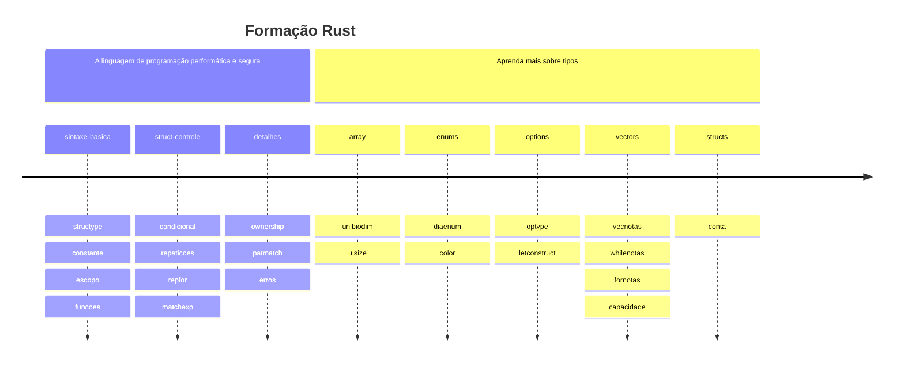

# Rust exercises for Alura's Rust course

- This repo contains some exercises adapted from Alura's Rust courses _[Rust: a linguagem de programação performática e segura](https://www.alura.com.br/curso-online-rust-linguagem-programacao-performatica-segura)_ and _[Rust: aprenda mais sobre tipos](https://www.alura.com.br/curso-online-rust-aprenda-sobre-tipos)_.

---



---

## Topics

- The exercises are separated by topic and are in the `src` folder.

### 1. Rust: a linguagem de programação performática e segura

1. Sintaxe básica
   1. [Primitive types](src/exemplos/sintaxe-basica/constante.rs)
   2. [Scope and Shadowning](src/exemplos/sintaxe-basica/escopo.rs)
   3. [Declare functions](src/exemplos/sintaxe-basica/funcoes.rs)
2. Estruturas de controle
   1. [Conditionals](src/exemplos/struct-controle/condicional.rs)
   2. [Working with loops](src/exemplos/struct-controle/repeticoes.rs)
   3. [Working with for and ranges](src/exemplos/struct-controle/repfor.rs)
   4. [Match statement](src/exemplos/struct-controle/matchexp.rs)
3. Detalhes da linguagem
   1. [Ownership](src/exemplos/detalhes/ownership.rs)
   2. [Pattern matching](src/exemplos/detalhes/patmatch.rs)
   3. [Error treatment](src/exemplos/detalhes/erros.rs)

### Rust: aprenda mais sobre tipos

1. Sintaxe básica
   1. [Definir arrays multidimensionais](src/exemplos/sintaxe-basica/array.rs)
   2. [Usize e isize](src/exemplos/sintaxe-basica/uisize.rs)
2. Enums
   1. [Criar tipos usando enums](src/exemplos/enums/diaenum.rs)
   2. [Passar valores para um enum](src/exemplos/enums/color.rs)
3. Options
   1. [Optional types](src/exemplos/options/optype.rs)
   2. [Using if let construct](src/exemplos/options/letconstruct.rs)
4. Vectors
   1. [Vectors with dynamic size](src/exemplos/vectors/vecnotas.rs)
   2. [Accesing vectors with while](src/exemplos/vectors/whilenotas.rs)
   3. [Iterating over vectors with for](src/exemplos/vectors/fornotas.rs)
   4. [Memory allocation and capacity](src/exemplos/vectors/capacidade.rs)
5. Structs
   1. [Creating structs and add methods in it](src/exemplos/structs/conta.rs)

## Running the exercises

- Run main.rs

```bash
cargo run
```

- Run a specific file

```bash
rustc src/exemplos/sintaxe-basica/structype.rs

./structype.rs
```
